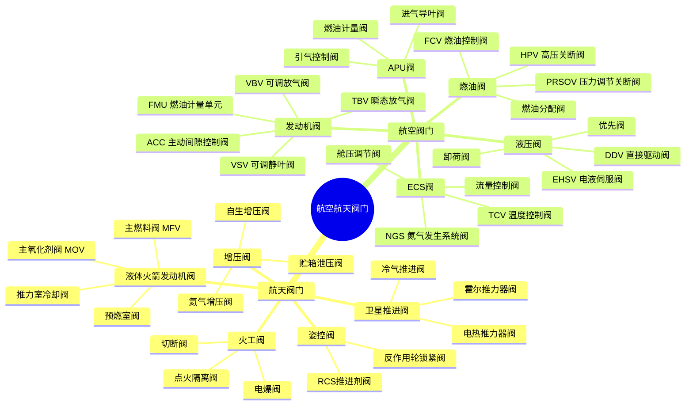
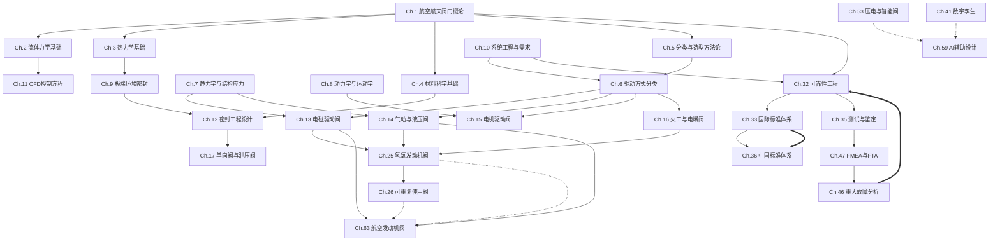
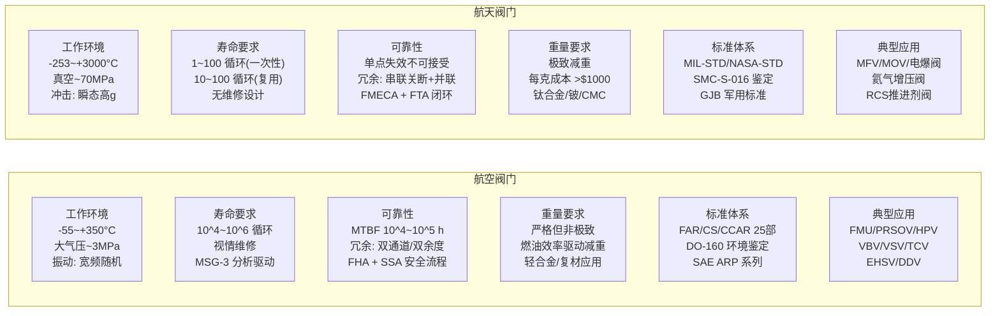
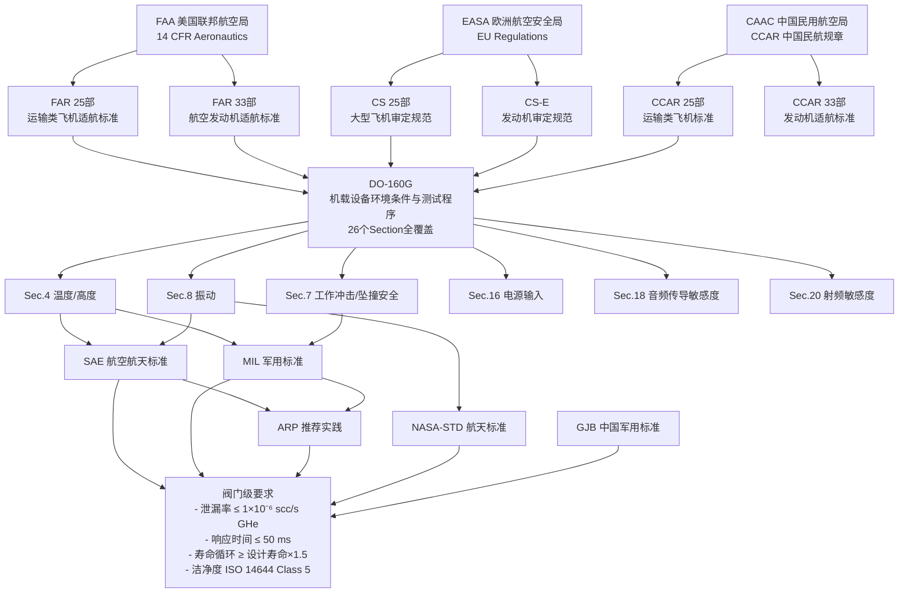
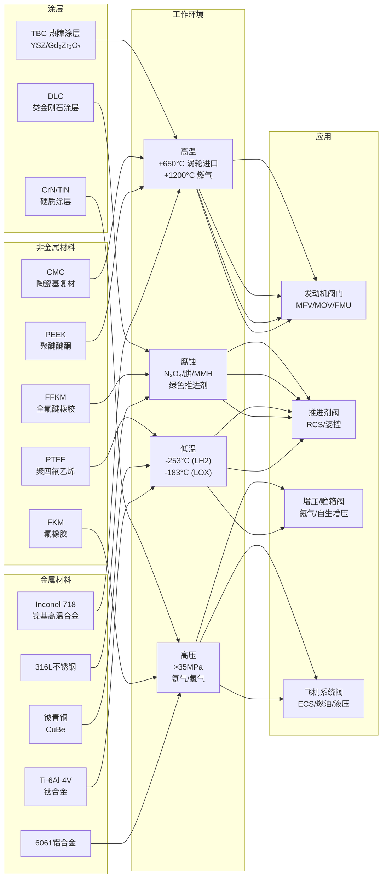

# 知识图谱

> Avis 航空航天阀门知识体系的可视化探索 — 六大维度交互式图谱

---

## 锚点导航

- [阀门分类学](#1-阀门分类学树状图)
- [知识体系网络](#2-知识体系网络图)
- [航空/航天对比](#3-航空航天阀门对比图)
- [故障模式关联](#4-故障模式-原因-影响关联图)
- [标准体系](#5-标准体系层级图)
- [材料应用矩阵](#6-材料-应用-环境矩阵图)

---

## 1. 阀门分类学树状图

以「航空航天阀门」为根节点，按照领域—系统—功能的层次逐级展开，涵盖航天推进阀门的7大子类与航空阀门的5大系统分支。该分类体系对应 [第5章 分类与选型方法论](/guide/part1/chapter-05) 中的多维度分类框架。

---

## 2. 知识体系网络图

展示Avis六编核心章节之间的知识依赖关系。从**第1章 概论**出发，依照先基础后专精、先设计后验证的原则逐层展开。实线箭头表示前置依赖（precursor），虚线表示交叉引用（reference），双线表示跨领域对比（contrast）。

> 图例：`→` 前置依赖 | `-.->` 交叉引用 | `==>` 跨领域对比

---

## 3. 航空/航天阀门对比图

航空阀门与航天阀门虽然共享基础理论和设计方法，但在工作环境、寿命、可靠性模型、重量约束和标准体系上存在系统级差异。以下对比基于 [第25章](/guide/part2/chapter-25)、[第26章](/guide/part2/chapter-26)、[第63章](/guide/part2/chapter-63) 和 [第68章](/guide/part2/chapter-68) 的核心数据。

---

## 4. 故障模式-原因-影响关联图

阀门在航空航天服役过程中面临六大典型故障模式。每种模式均有特定的失效机制、直接原因和工程缓解措施。该图谱整合了 [第46章 重大故障分析](/guide/part4/chapter-46)、[第47章 FMEA与FTA](/guide/part4/chapter-47) 和 [附录E FMECA速查](/guide/appendix/appendix-e) 的内容。

```mermaid
graph TD
  FM1["故障模式: 卡滞<br/>Sticking/Binding"]
  FM2["故障模式: 泄漏<br/>Leakage"]
  FM3["故障模式: 断裂<br/>Fracture"]
  FM4["故障模式: 腐蚀<br/>Corrosion"]
  FM5["故障模式: 磨损<br/>Wear"]
  FM6["故障模式: 电气故障<br/>Electrical Failure"]

  C1a["污染颗粒嵌入配合间隙"]
  C1b["热膨胀导致间隙消失"]
  C1c["润滑剂降解/挥发"]
  C2a["密封面疲劳/蠕变"]
  C2b["O形圈压缩永久变形"]
  C2c["焊接缺陷/微裂纹"]
  C3a["HCF高周疲劳"]
  C3b["LCF低周/热机械疲劳"]
  C3c["应力腐蚀开裂 SCC"]
  C4a["推进剂化学腐蚀"]
  C4b["电偶腐蚀"]
  C4c["高温氧化/硫化"]
  C5a["微动磨损 Fretting"]
  C5b["冲蚀 Erosion"]
  C5c["粘着磨损 Adhesive"]
  C6a["线圈短路/断路"]
  C6b["绝缘击穿"]
  C6c["连接器接触不良"]

  E1["阀门无法开关<br/>推力裕度丧失"]
  E2["推进剂/工质流失<br/>密封等级降级"]
  E3["结构完整性丧失<br/>灾难性失效"]
  E4["材料性能退化<br/>寿命缩短"]
  E5["配合间隙增大<br/>内漏加剧"]
  E6["指令响应失效<br/>丧失控制"]

  M1a["洁净度等级提升<br/>微粒过滤<10μm"]
  M1b["间隙热补偿设计<br/>CTE匹配"]
  M1c["固体润滑膜 MoS₂/PTFE"]
  M2a["金属密封 + 冗余密封"]
  M2b["FFKM/全氟醚耐温密封"]
  M2c["100%氦检漏 + 射线探伤"]
  M3a["S-N曲线 + Goodman修正"]
  M3b["热-力耦合FEA + 循环试验"]
  M3c["材料选择: Inconel 718/钛合金"]
  M4a["兼容性浸泡试验"]
  M4b["绝缘垫片 + 表面处理"]
  M4c["TBC热障涂层 + 耐热合金"]
  M5a["硬质涂层 CrN/TiN"]
  M5b["流道优化降低流速"]
  M5c["材料配对优化"]
  M6a["双绕组冗余设计"]
  M6b["HIRF/雷电防护"]
  M6c["金触点 + 密封连接器"]

  FM1 --> C1a --> E1 --> M1a
  FM1 --> C1b --> E1 --> M1b
  FM1 --> C1c --> E1 --> M1c
  FM2 --> C2a --> E2 --> M2a
  FM2 --> C2b --> E2 --> M2b
  FM2 --> C2c --> E2 --> M2c
  FM3 --> C3a --> E3 --> M3a
  FM3 --> C3b --> E3 --> M3b
  FM3 --> C3c --> E3 --> M3c
  FM4 --> C4a --> E4 --> M4a
  FM4 --> C4b --> E4 --> M4b
  FM4 --> C4c --> E4 --> M4c
  FM5 --> C5a --> E5 --> M5a
  FM5 --> C5b --> E5 --> M5b
  FM5 --> C5c --> E5 --> M5c
  FM6 --> C6a --> E6 --> M6a
  FM6 --> C6b --> E6 --> M6b
  FM6 --> C6c --> E6 --> M6c
```

---

## 5. 标准体系层级图

航空航天阀门需遵循从适航法规到产品标准的四级标准体系。顶层为 FAA、EASA、CAAC 三极适航当局的法规框架，逐层细化至阀门具体设计/鉴定标准。详见 [第33章 国际标准体系](/guide/part3/chapter-33) 和 [第36章 中国标准体系](/guide/part3/chapter-36)。

---

## 6. 材料-应用-环境矩阵图

阀门材料的选择需匹配极端服役环境。从低温液氢到高温燃气，材料性能直接决定阀门的可靠性与寿命。本图谱覆盖 [第4章 材料科学基础](/guide/part1/chapter-04)、[第19章 表面工程](/guide/part2/chapter-19)、[第43章 新型材料](/guide/part4/chapter-43) 和 [第57章 绿色推进剂兼容性](/guide/part5/chapter-57)。

---

## 图谱数据来源

| 图谱 | 核心数据源 |
|------|-----------|
| 阀门分类学 | [valve-taxonomy.json](<E:\Avis-System\knowledge-graph\ontology\valve-taxonomy.json>) — 6维度30节点 |
| 知识体系网络 | [chapter-relationships.json](<E:\Avis-System\knowledge-graph\cross-references\chapter-relationships.json>) — 104条知识依赖边 |
| 航空/航天对比 | [第25章](/guide/part2/chapter-25) [第26章](/guide/part2/chapter-26) [第63章](/guide/part2/chapter-63) [第68章](/guide/part2/chapter-68) |
| 故障模式关联 | [第46章](/guide/part4/chapter-46) [第47章](/guide/part4/chapter-47) [附录E](/guide/appendix/appendix-e) |
| 标准体系 | [第33章](/guide/part3/chapter-33) [第36章](/guide/part3/chapter-36) |
| 材料应用 | [第4章](/guide/part1/chapter-04) [第19章](/guide/part2/chapter-19) [第43章](/guide/part4/chapter-43) |

## 相关资源

- [术语词典](/glossary) — 130+术语详解
- [手册浏览](/guide/part1-index) — 六编72章完整内容
- [概念-章映射](<E:\Avis-System\knowledge-graph\cross-references\concept-chapter-map.json>) — 83个概念 × 关联章节