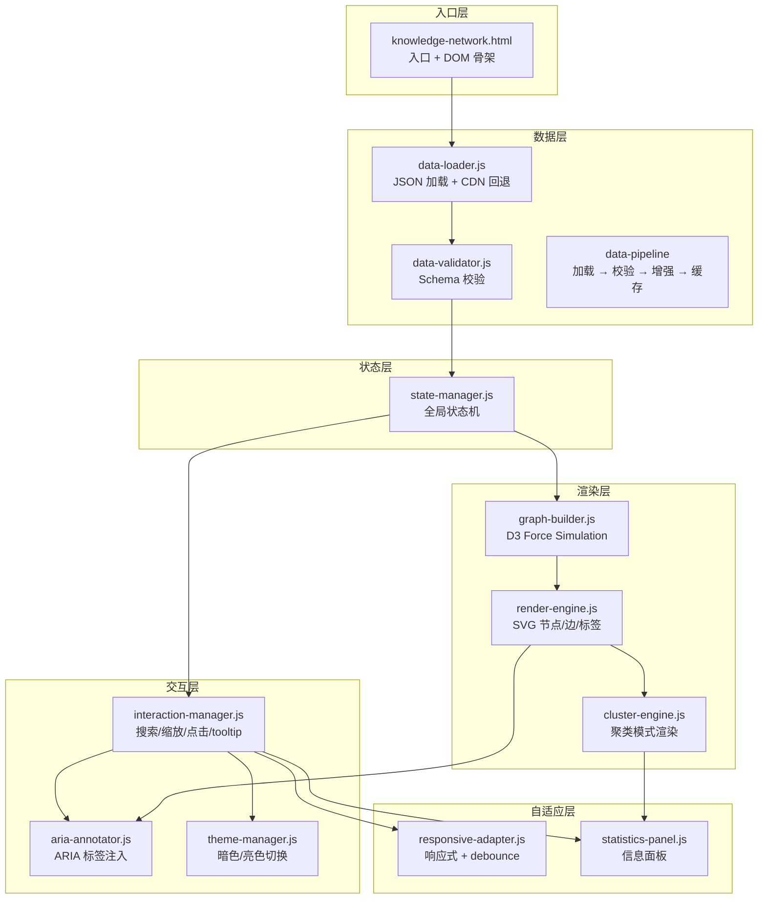
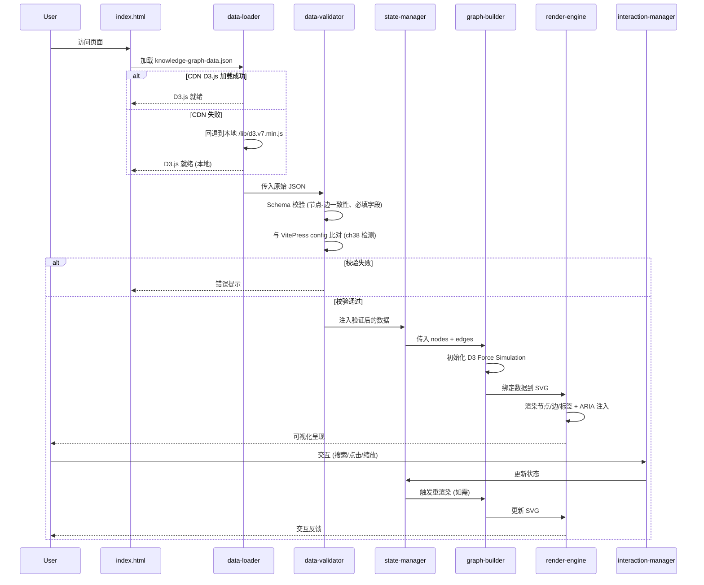
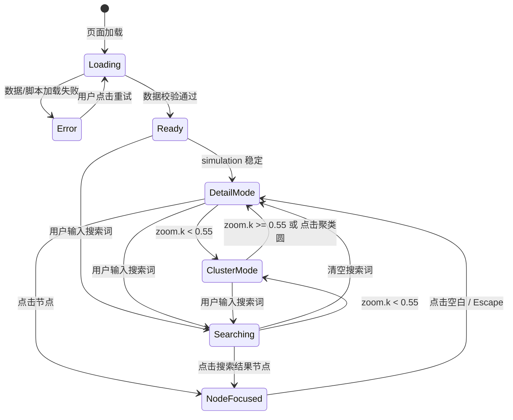
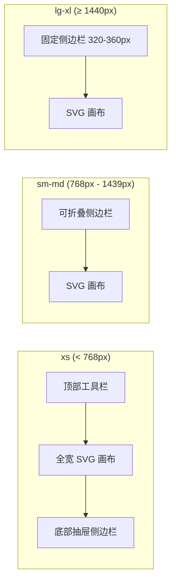
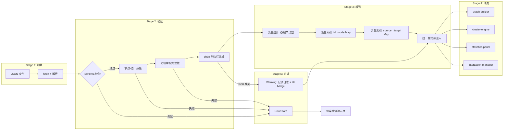
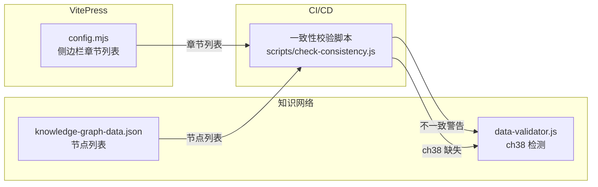

# Avis 知识网络页面 — 架构设计报告

> **文档版本**: v1.0  
> **编制日期**: 2026-06-03  
> **编制依据**: [需求分析报告](E:\Avis-System\web\output\requirements-report.md)（16项FR + 17项NFR）  
> **覆盖审计项**: C-1, H-1~H-5, M-1~M-8, L-1~L-6（共20项）

---

## 目录

1. [架构概览](#1-架构概览)
2. [组件架构设计](#2-组件架构设计)
3. [数据流设计](#3-数据流设计)
4. [状态管理模式](#4-状态管理模式)
5. [前端技术选型论证](#5-前端技术选型论证)
6. [响应式断点设计](#6-响应式断点设计)
7. [可访问性 ARIA 策略](#7-可访问性-aria-策略)
8. [数据管道架构](#8-数据管道架构)
9. [性能优化策略](#9-性能优化策略)
10. [错误处理与降级策略](#10-错误处理与降级策略)
11. [路由与导航集成架构](#11-路由与导航集成架构)
12. [需求追溯与验收清单](#12-需求追溯与验收清单)

---

## 1. 架构概览

### 1.1 设计原则

| 原则 | 说明 | 对应审计修复 |
|------|------|-------------|
| **可靠优先** | CDN 不可用不影响核心功能；所有异常路径有 UI 反馈 | C-1, H-3 |
| **数据驱动** | JSON 是唯一权威源，JS 不重复定义颜色、样式、统计值 | H-1, M-1 |
| **渐进增强** | 基础 HTML 结构可用，JS 增强交互，ARIA 增强可访问性 | H-4, H-5 |
| **关注分离** | 数据层 / 渲染层 / 交互层 / 状态层严格解耦 | M-2, M-3, M-6 |
| **移动优先** | 响应式设计从小屏出发，逐步增强至大屏布局 | H-5 |

### 1.2 系统边界

```
┌─────────────────────────────────────────────────┐
│                  VitePress 站点                    │
│  ┌──────────────┐  ┌──────────────────────────┐  │
│  │ vitepress/    │  │  knowledge-network.html   │  │
│  │  config.mjs   │  │  (独立页面，非 SPA 嵌入)   │  │
│  │  侧边栏配置    │  │                          │  │
│  └──────┬───────┘  └───────────┬──────────────┘  │
│         │      双向数据同步      │                  │
│         └──────────────────────┘                  │
└─────────────────────────────────────────────────┘
```

页面为 VitePress 站点内的独立 HTML 页面，通过 `<script>` 标签自包含 D3.js 和所有渲染逻辑。与 VitePress 的关系是：共享域名/路径前缀，共享侧边栏章节定义（需要数据一致性校验），但不依赖 VitePress 的 Vue SPA 运行时。

---

## 2. 组件架构设计

### 2.1 模块分解

将当前单文件 1179 行 monolithic HTML 拆分为以下逻辑模块：

```
knowledge-network.html           (入口文件, < 100 行)
├── js/
│   ├── config.js                (常量配置: 断点、颜色回退、动画时长)
│   ├── data-loader.js           (JSON 加载 + 校验 + 增强)
│   ├── data-validator.js        (Schema 校验: 节点-边一致性、必填字段)
│   ├── graph-builder.js         (D3 force simulation 构建)
│   ├── render-engine.js         (SVG 节点/边/标签渲染)
│   ├── cluster-engine.js        (聚类模式: 聚合圆 + 聚类边)
│   ├── interaction-manager.js   (搜索、缩放、点击、tooltip、键盘)
│   ├── state-manager.js         (全局状态: 模式切换、暗色主题)
│   ├── aria-annotator.js        (ARIA 标签注入)
│   ├── responsive-adapter.js    (响应式布局 + resize debounce)
│   ├── statistics-panel.js      (侧边栏信息面板更新)
│   └── theme-manager.js         (暗色/亮色主题切换 + CSS 变量)
```

### 2.2 组件架构图



### 2.3 组件职责与需求映射

| 模块 | 核心职责 | 映射 FR/NFR |
|------|---------|------------|
| `data-loader.js` | JSON 获取、CDN 回退、错误提示 | FR-04, NFR-01, NFR-02 |
| `data-validator.js` | Schema 校验、节点-边一致性、ch38 与侧边栏比对 | FR-03, NFR-10 |
| `state-manager.js` | `isClustered` / `currentMode` / 原子状态切换 | FR-11, FR-12 |
| `graph-builder.js` | D3 force simulation，聚类模式暂停/恢复 | FR-05, NFR-04 |
| `render-engine.js` | SVG 创建、`tspan dx` 替换 `x`、颜色从 JSON 读取 | FR-02, M-7 |
| `cluster-engine.js` | 聚类圆半径映射、聚类边过滤 | FR-07, L-3 |
| `interaction-manager.js` | 搜索、缩放、tooltip、键盘导航 | FR-10, FR-14 |
| `aria-annotator.js` | ARIA role/label 注入 | FR-13, NFR-11, NFR-12 |
| `responsive-adapter.js` | 断点管理、resize debounce、侧边栏折叠 | NFR-05, NFR-14, NFR-15 |
| `theme-manager.js` | CSS 变量、SVG transition | FR-08, L-5 |
| `statistics-panel.js` | 信息面板 transitionend 驱动更新 | FR-09, L-4 |

---

## 3. 数据流设计

### 3.1 端到端数据流



### 3.2 关键决策点

| 决策点 | 触发条件 | 行为 | 对应需求 |
|--------|---------|------|---------|
| CDN 回退 | `window.d3 === undefined` | 动态创建 `<script>` 加载本地 `/lib/d3.v7.min.js` | NFR-01 |
| 聚类模式切换 | `zoom.k < 0.55` | `simulation.stop()` + 构建聚类视图 | FR-05, NFR-04 |
| 聚类退出 | 用户点击聚类圆或缩放 > 0.55 | 重建节点视图 + `simulation.alpha(0.3).restart()` | FR-12 |
| 搜索无匹配 | `filteredNodes.length === 0` | 信息面板显示"未找到匹配章节" | FR-10 |

---

## 4. 状态管理模式

### 4.1 状态机定义



### 4.2 状态对象设计

```javascript
// state-manager.js 核心状态结构
const AppState = {
  mode: 'loading',       // 'loading' | 'ready' | 'error'
  view: 'detail',        // 'detail' | 'cluster'
  focus: null,           // null | { nodeId, source }
  searchQuery: '',       // 当前搜索词
  searchResults: [],     // 匹配的 nodeId 列表
  theme: 'light',        // 'light' | 'dark'
  isTransitioning: false // 动画/transition 进行中标志
};
```

### 4.3 关键状态迁移约束

| 约束 | 规则 | 修复的审计问题 |
|------|------|--------------|
| **聚类退出原子性** | `view: 'cluster' → 'detail'` 迁移仅在所有 transition `.on('end')` 回调中完成；`isTransitioning=true` 期间拒绝重复迁移 | H-3 (竞态条件) |
| **统计更新原子性** | 统计面板更新与 `view` 切换绑定在同一帧 | M-8 (统计闪烁) |
| **搜索状态保护** | 搜索期间 `view` 切换不重置 `searchResults`；清空搜索词时统一清理 | M-5 |
| **进场动画同步** | `simulation.on('end')` 触发后才将 `mode` 设为 `ready` 并启动淡入动画 | M-6 (动画跳跃) |

---

## 5. 前端技术选型论证

### 5.1 选型分析

| 维度 | 纯 D3.js (模块化) | Vue 3 + D3.js | React + D3.js |
|------|-------------------|---------------|---------------|
| 与现有 VitePress 集成 | 独立页面，零依赖冲突 | VitePress 本身是 Vue，有一定亲和性 | 引入额外运行时 |
| 学习曲线 | 低（现有代码基础） | 中 | 中 |
| Bundle 大小 | ~180KB (D3.js) | ~180KB + ~33KB (Vue runtime) | ~180KB + ~40KB (React) |
| SVG 渲染性能 | 最优（D3 直接操作 DOM） | 优（但 Vue 响应式包裹 D3 有开销） | 优（但需处理 ref 同步） |
| 组件复用 | 低（需手工模块化） | 高（SFC 组件） | 高（JSX 组件） |
| 力导向图特殊处理 | D3 原生，无缝 | 需小心隔离 D3 与 Vue 的 DOM 更新 | 需 `useRef` 隔离 |
| 重构代价 | 模块化拆分（中等） | 全量重写（高） | 全量重写（高） |

### 5.2 推荐方案：纯 D3.js + ES 模块化 + 构建工具

**决策理由**：

1. **页面独立性**：知识网络页面是 VitePress 站点中的独立 HTML 页面，不需要 SPA 路由或组件树。引入 Vue/React 运行时属于过度工程化。
2. **D3 力导向图特殊性**：D3 force simulation 直接通过数据绑定操作 DOM，与 Vue 的虚拟 DOM / React 的 reconciliation 天然冲突。强制融合需要大量 `ref` 隔离和 `shouldComponentUpdate` 调优，得不偿失。
3. **性能要求**：62 节点 + 84 边的规模下，D3 原生操作 DOM 比框架包裹更高效，无虚拟 DOM diff 开销。
4. **构建集成**：可利用 VitePress 底层的 Vite 构建工具，将 JS 模块打包为单文件，享受 tree-shaking、minification、SRI hash 注入。

**技术栈**：

| 层级 | 技术选择 | 说明 |
|------|---------|------|
| 可视化引擎 | D3.js v7 | 力导向布局、缩放、数据绑定 |
| 模块系统 | ES Modules | 原生 `import/export`，Vite 构建 |
| 构建工具 | Vite (复用 VitePress) | 打包 JS 模块为单文件，注入 SRI hash |
| CSS 方案 | CSS Custom Properties + PostCSS | 主题切换、响应式断点 |
| 校验库 | Ajv (JSON Schema) | 可选；轻量时可手写校验函数 |
| 测试 | Vitest + Playwright | 单元测试 + E2E 可视化回归 |

**CDN 安全策略**（修复 C-1）：

```html
<!-- 主加载：CDN + SRI -->
<script src="https://d3js.org/d3.v7.min.js"
        integrity="sha384-xxxxxxxxxxxxxxxxxxxxxxxxxxxxxxxxxxxxxxxxxxxxxxxxxxxxxxxxxxxx"
        crossorigin="anonymous"></script>

<!-- 回退：本地 bundle -->
<script>
window.d3 || document.write('<script src="/lib/d3.v7.min.js"><\/script>');
</script>
```

---

## 6. 响应式断点设计

### 6.1 断点定义

| 断点名称 | 最小宽度 | 典型设备 | 侧边栏行为 | 画布策略 |
|---------|---------|---------|-----------|---------|
| **xs** | 0 - 767px | 手机竖屏 | 底部可折叠抽屉（默认折叠） | 全宽 SVG，节点半径缩小 20% |
| **sm** | 768px - 1023px | 平板竖屏 | 左侧可折叠面板（默认折叠） | 画布占剩余空间 |
| **md** | 1024px - 1439px | 笔记本/平板横屏 | 左侧固定 280px | 画布 flex-grow 填充 |
| **lg** | 1440px - 1919px | 桌面显示器 | 左侧固定 320px | 画布 flex-grow 填充 |
| **xl** | ≥ 1920px | 大屏/超宽 | 左侧固定 360px | 画布 flex-grow 填充，节点半径放大 10% |

### 6.2 布局策略



### 6.3 关键 CSS 结构

```css
:root {
  --sidebar-width: 320px;
  --sidebar-collapsed: 0px;
  --node-scale: 1;
}

@media (max-width: 767px) {
  :root {
    --sidebar-width: 100%;
    --sidebar-position: bottom;
    --node-scale: 0.8;
  }
  #sidebar {
    position: fixed;
    bottom: 0;
    max-height: 40vh;
    transform: translateY(100%);
    transition: transform 0.3s ease;
  }
  #sidebar.open {
    transform: translateY(0);
  }
}

@media (min-width: 768px) and (max-width: 1023px) {
  :root { --sidebar-width: 280px; --node-scale: 0.9; }
}

@media (min-width: 1440px) {
  :root { --sidebar-width: 320px; --node-scale: 1; }
}

@media (min-width: 1920px) {
  :root { --sidebar-width: 360px; --node-scale: 1.1; }
}
```

**对应需求**: NFR-14, NFR-15；修复审计项 H-5。

---

## 7. 可访问性 ARIA 策略

### 7.1 分层 ARIA 架构

```
┌────────────────────────────────────────────┐
│  Layer 3: 实时区域 (Live Region)            │
│  aria-live="polite" 状态播报                │
├────────────────────────────────────────────┤
│  Layer 2: 交互元素 ARIA                     │
│  role="button" / aria-expanded /            │
│  aria-activedescendant                     │
├────────────────────────────────────────────┤
│  Layer 1: 静态语义标注                       │
│  role="img" / aria-label / <title> 子元素   │
└────────────────────────────────────────────┘
```

### 7.2 ARIA 标注映射

| SVG 元素 | ARIA 属性 | 值示例 | 对应需求 |
|---------|----------|--------|---------|
| `<svg>` | `role="img"` | — | FR-13 |
| `<svg>` | `aria-label` | "Avis 知识网络力导向图，62个章节节点，84条知识关联边" | FR-13 |
| 每个 `<g.node-group>` | 内含 `<title>` | "ch01: 航空电子系统概论 — 第1编, 重要性 4/5" | FR-13 |
| 每个 `<g.node-group>` | `role="button"` | — | FR-14 |
| 每个 `<g.node-group>` | `tabindex="0"` | — | FR-14 |
| 每个 `<g.node-group>` | `aria-label` | "ch01: 航空电子系统概论" | FR-13 |
| 聚类圆 `<circle>` | `role="button"` | — | FR-14 |
| 聚类圆 `<circle>` | `aria-label` | "第1编: 基础理论，含5个章节，双击进入" | FR-13 |
| 信息面板 `<div>` | `aria-live="polite"` | — | FR-10 |
| 搜索框 `<input>` | `role="searchbox"` | — | FR-14 |
| 搜索框 `<input>` | `aria-label` | "搜索知识网络章节" | FR-13 |

### 7.3 键盘导航规范

| 按键 | 上下文 | 行为 |
|------|--------|------|
| Tab / Shift+Tab | 全局 | 在搜索框 → 节点列表 → 侧边栏按钮之间移动焦点 |
| Arrow Keys | 节点聚焦时 | 在关联节点间导航（沿边遍历） |
| Enter / Space | 节点聚焦时 | 选中节点，高亮关联边 |
| Escape | 任何状态 | 取消选中 / 退出聚类模式 / 清空搜索 |

**对应需求**: FR-13, FR-14, NFR-11, NFR-12, NFR-13；修复审计项 H-4。

---

## 8. 数据管道架构

### 8.1 管道总览



### 8.2 校验规则定义

```javascript
// data-validator.js 核心校验逻辑
const ValidationRules = {
  // 1. 节点 ID 唯一性
  nodeIdUnique: (nodes) => {
    const ids = nodes.map(n => n.id);
    return new Set(ids).size === ids.length;   // → FR-01, NFR-10
  },

  // 2. 边端点有效性
  edgeEndpoints: (edges, nodeMap) => {
    return edges.every(e =>
      nodeMap.has(e.source) && nodeMap.has(e.target)
    );                                         // → NFR-10
  },

  // 3. 必填字段完整性
  requiredFields: (nodes) => {
    const required = ['id', 'label', 'part', 'importance', 'url', 'description'];
    return nodes.every(n => required.every(f => n[f] !== undefined && n[f] !== null));
  },

  // 4. ch38 侧边栏比对 (FR-03)
  sidebarConsistency: (nodeIds, sidebarChapters) => {
    const missing = sidebarChapters.filter(ch => !nodeIds.includes(ch));
    return { consistent: missing.length === 0, missing };
  },

  // 5. 颜色/样式源统一校验 (FR-02, M-1)
  styleSourceUnique: (jsonData, jsConstants) => {
    // 确保 JS 中的 PART_COLORS 直接从 JSON 的 partColors 读取
    // 而不是硬编码独立维护
  }
};
```

### 8.3 样式统一方案

**修复 M-1**：JSON 中的 `partColors` 和 `relationStyles` 成为唯一权威源。移除 JS 中的独立 `PART_COLORS` / `RELATION_STYLES` 常量定义。

```javascript
// 旧方案 (M-1 违规)
const PART_COLORS = { 1: '#3B82F6', 2: '#10B981', ... };  // JS 硬编码
// JSON 中也有 partColors → 死数据

// 新方案 (FR-02)
// graph-builder.js
const partColors = graphData.partColors;       // 从 JSON 读取
const relationStyles = graphData.relationStyles; // 从 JSON 读取
// JSON 是唯一权威源
```

---

## 9. 性能优化策略

### 9.1 优化措施清单

| 编号 | 优化措施 | 目标 | 对应需求 | 修复审计项 |
|------|---------|------|---------|-----------|
| PERF-01 | **聚类模式暂停 simulation** | 聚类视图 CPU 占用降低 ≥ 60% | NFR-04 | M-3 |
| PERF-02 | **ResizeObserver + 150ms debounce** | resize handler 调用频率 ≤ 7Hz | NFR-05 | M-4 |
| PERF-03 | **CDN 本地 fallback** | CDN 故障 FCP ≤ 3.5s | NFR-01, NFR-03 | C-1 |
| PERF-04 | **SRI integrity hash** | 防止 CDN 投毒导致的性能回退 | NFR-16 | C-1 |
| PERF-05 | **CSS containment** | `contain: layout style paint` 隔离侧边栏与画布重绘 | — | — |
| PERF-06 | **requestAnimationFrame 批量 DOM 更新** | 统计面板/搜索高亮合并到同一帧 | NFR-06 | M-8 |
| PERF-07 | **仿真冷却提前终止** | `simulation.alpha(0.3).alphaDecay(0.02)` 加速稳定收敛 | — | M-6 |

### 9.2 关于虚拟化、懒加载、Web Worker 的评估

| 技术 | 适用性评估 | 结论 |
|------|-----------|------|
| **虚拟化 (Virtual Scrolling)** | 知识网络是空间拓扑而非线性列表，62 节点不存在"视口外"概念 | **不适用**。力导向图所有节点位置需全局计算 |
| **懒加载 (Lazy Loading)** | 数据量仅 62 节点 / 84 边，JSON 约 15KB，加载开销可忽略 | **不适用**。全量加载零收益，反增复杂度 |
| **Web Worker** | force simulation 计算可移至 Worker 线程 | **可选优化**。当前规模下 simulation 收敛 < 2s；若未来节点增至 200+ 可启用 Worker 避免主线程阻塞 |

### 9.3 构建优化

```
Vite Build Pipeline:
  ES Modules (js/*.js)
    → Rollup 打包
      → Tree-shaking (移除未使用的 D3 子模块)
        → Minification (Terser)
          → SRI Hash 注入
            → 输出单文件 dist/knowledge-network.html
              → gzip ≤ 100KB (不含 D3.js)
```

---

## 10. 错误处理与降级策略

### 10.1 错误分类与响应

```mermaid
flowchart TD
    A[错误发生] --> B{错误类型}

    B -->|CDN 加载失败| C1[自动回退本地 D3.js]
    C1 --> C2{SRI 校验}
    C2 -->|通过| C3[正常初始化]
    C2 -->|失败| C4[显示错误: D3.js 校验失败]

    B -->|JSON 加载失败| D1[显示错误提示 + 重试按钮]
    D1 --> D2[记录错误信息到控制台]

    B -->|JSON 校验失败| E1[显示具体校验错误]
    E1 --> E2[标记问题节点/边]
    E2 --> E3[跳过非法数据，渲染其余]

    B -->|D3 运行时错误| F1[全局 try-catch]
    F1 --> F2[回退到静态 SVG 视图]
    F2 --> F3[显示降级信息]

    B -->|ch38 缺失 (Warning)| G1[UI badge 提示数据同步延迟]
    G1 --> G2[正常渲染其余 61 个节点]
```

### 10.2 降级层级

| 层级 | 条件 | 用户可见行为 |
|------|------|-------------|
| **L0: 全功能** | 所有资源正常加载 | 力导向图 + 搜索 + 聚类 + 暗色模式 |
| **L1: CDN 回退** | CDN 不可达，本地 D3 可用 | 同 L0（本地 D3.js 版本） |
| **L2: 部分数据** | JSON 中个别节点/边校验失败 | 跳过问题数据，badge 提示，其余正常渲染 |
| **L3: 静态回退** | D3 运行时错误 | 静态 SVG 渲染（无交互），显示降级提示 |
| **L4: 完全故障** | 所有资源不可用 | 纯文本错误提示 + 重试按钮 |

### 10.3 错误 UI 设计

```html
<!-- L3/L4 降级 UI 模板 -->
<div class="error-state" role="alert">
  <h2>知识网络加载失败</h2>
  <p id="error-message"><!-- 动态填充具体错误 --></p>
  <button onclick="location.reload()">重试</button>
  <p class="error-hint">
    如果问题持续，请检查网络连接或
    <a href="/guide/">返回文档首页</a>
  </p>
</div>
```

**对应需求**: FR-04, NFR-01, NFR-02；修复审计项 C-1, H-1。

---

## 11. 路由与导航集成架构

### 11.1 与 VitePress 站点的关系

```
VitePress 站点结构:
├── index.md                       (站点首页，含知识网络导航入口)
├── guide/
│   ├── part1/chapter-01.md       (章节内容)
│   ├── ...
│   └── part6/chapter-62.md
├── public/
│   ├── knowledge-network.html     (知识网络独立页面)
│   └── knowledge-graph-data.json  (数据文件)
├── .vitepress/
│   └── config.mjs                 (侧边栏配置 + 主题)
└── lib/
    └── d3.v7.min.js               (D3.js 本地 fallback)
```

### 11.2 双向数据同步机制



### 11.3 导航链接策略

| 来源 | 目标 | 链接格式 |
|------|------|---------|
| VitePress 侧边栏 | 知识网络页面 | `/knowledge-network.html` |
| 知识网络节点 click | 对应章节 | `/guide/part{n}/chapter-{nn}.html` |
| 知识网络 `index.md` 入口 | 知识网络页面 | `/knowledge-network.html` |
| 错误降级页 | 文档首页 | `/guide/` |

### 11.4 一致性校验脚本

```javascript
// scripts/check-consistency.js (CI 中运行)
// 1. 解析 config.mjs 提取所有章节 link → 提取 chapter ID
// 2. 读取 knowledge-graph-data.json 提取所有 node.id
// 3. 比对差异，输出缺失/多余项
// 4. 发现 ch38 缺失时报错，阻止部署
```

**对应需求**: FR-03, FR-16；修复审计项 H-2, L-6。

---

## 12. 需求追溯与验收清单

### 12.1 完整追溯矩阵

| 审计项 | FR | NFR | 架构章节 | 验收方式 |
|--------|----|-----|---------|---------|
| C-1 | FR-04 | NFR-01, NFR-03, NFR-16 | §5, §10 | 模拟 CDN 不可达，页面正常渲染 |
| H-1 | FR-01 | NFR-10 | §3, §8.2 | 审查 HTML，确认无数值硬编码 |
| H-2 | FR-03 | NFR-10 | §8.2, §11 | 运行 check-consistency.js |
| H-3 | FR-12 | — | §3.4, §4.3 | 快速连续缩放，无闪烁 |
| H-4 | FR-13, FR-14 | NFR-11, NFR-12, NFR-13 | §7 | axe DevTools 0 Violation |
| H-5 | — | NFR-14, NFR-15 | §6 | 375px/768px/1440px 设备模拟通过 |
| M-1 | FR-02 | NFR-08 | §8.3 | 代码审查：JS 中无独立颜色常量 |
| M-2 | — | NFR-09 | §3.2 | ESLint + 人工审查 |
| M-3 | FR-05 | NFR-04 | §9.1 | Chrome DevTools Performance |
| M-4 | — | NFR-05 | §9.1 | 计数器验证 |
| M-5 | FR-10 | — | §3.3 | 搜索不存在章节，验证提示出现 |
| M-6 | FR-06 | — | §3.2, §4.3 | 观察进场动画无跳跃 |
| M-7 | — | — | §3.2 | 审查 SVG tspan 使用 dx 属性 |
| M-8 | FR-11 | — | §4.3, §9.1 | 快速缩放验证统计数字 |
| L-1 | FR-15 | — | §2.2 | 审查 `<head>` 中 meta 标签 |
| L-2 | — | — | §3.2 | 审查 tooltip 代码 |
| L-3 | FR-07 | — | §3.2 | 聚类视图验证圆大小差异 |
| L-4 | FR-09 | — | §3.2 | 审查使用 transitionend |
| L-5 | FR-08 | — | §3.5 | 切换暗色模式，观察 SVG 过渡 |
| L-6 | FR-16 | — | §11 | 确认 knowledge-graph.md 存在 |

### 12.2 实施阶段

| 阶段 | 内容 | 审计项覆盖 | 预计工时 |
|------|------|-----------|---------|
| **Phase 1: 可靠性** | CDN fallback、数据动态绑定、竞态修复 | C-1, H-1, H-3 | 3h |
| **Phase 2: 数据与样式** | ch38 补全、样式统一、响应式布局 | H-2, M-1, H-5 | 6h |
| **Phase 3: 性能** | 聚类暂停 sim、resize debounce、动画同步 | M-3, M-4, M-6 | 3h |
| **Phase 4: 可访问性** | ARIA 全套标注、键盘导航 | H-4 | 5h |
| **Phase 5: 体验与SEO** | 搜索反馈、聚类圆、transitionend、暗色过渡、SEO | M-5, L-1, L-3, L-4, L-5, L-7 | 3h |
| **Phase 6: 文档与CI** | knowledge-graph.md、一致性校验脚本、模块化重构 | L-6, M-2, M-8 | 4h |
| **合计** | | 全部 20 项 | **24h** |

---

## 附录 A: 文件结构清单（重构后）

```
web/
├── public/
│   ├── knowledge-network.html          (入口: ~80行)
│   ├── knowledge-graph-data.json       (唯一数据源)
│   └── js/
│       ├── config.js                   (常量: 断点、动画时长、颜色回退)
│       ├── data-loader.js              (JSON fetch + CDN fallback)
│       ├── data-validator.js           (Schema 校验 + ch38 比对)
│       ├── state-manager.js            (状态机)
│       ├── graph-builder.js            (D3 force simulation)
│       ├── render-engine.js            (SVG 渲染: 节点/边/标签)
│       ├── cluster-engine.js           (聚类模式)
│       ├── interaction-manager.js      (搜索/缩放/点击/tooltip/键盘)
│       ├── aria-annotator.js           (ARIA 注入)
│       ├── responsive-adapter.js       (响应式 + resize debounce)
│       ├── statistics-panel.js         (信息面板)
│       └── theme-manager.js            (暗色/亮色主题)
├── lib/
│   └── d3.v7.min.js                    (CDN 本地 fallback)
├── scripts/
│   └── check-consistency.js            (CI: 侧边栏 vs JSON 比对)
├── output/
│   ├── audit-report.md                 (审计报告)
│   ├── requirements-report.md          (需求分析报告)
│   └── architecture-report.md          (架构设计报告)
├── .vitepress/
│   └── config.mjs                      (VitePress 配置 + 侧边栏)
└── index.md                            (站点首页)
```

---

*架构设计报告完成。需求基线请参见 [需求分析报告](E:\Avis-System\web\output\requirements-report.md)。*
